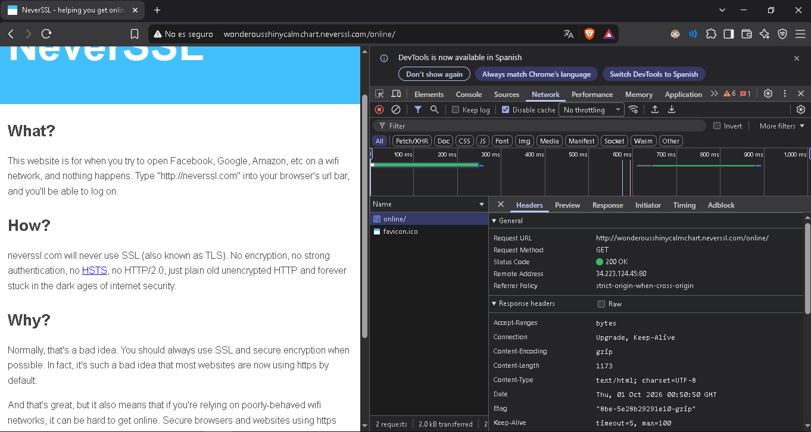
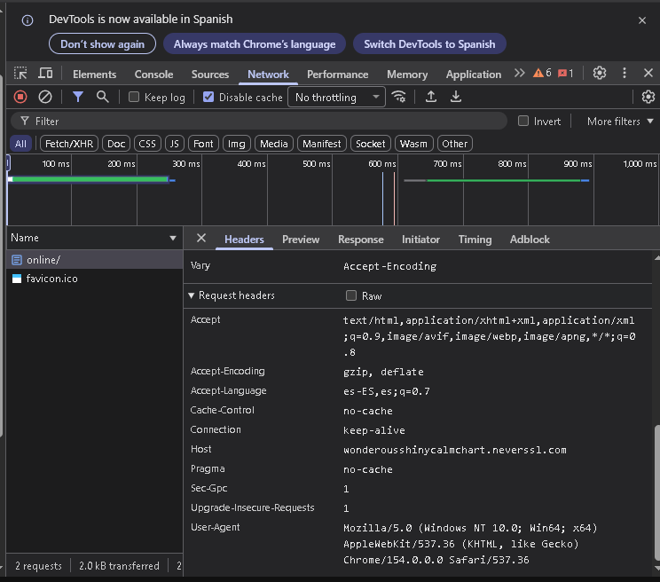

# Informe de Auditoría de Red Wi-Fi Insegura

Práctica de análisis de tráfico HTTP y recomendaciones de seguridad para redes Wi-Fi públicas.

## Introducción

Las redes Wi-Fi públicas (cafeterías, aeropuertos, hoteles) comparten el mismo medio físico entre todos los dispositivos conectados. Cuando el tráfico de una página viaja sin cifrar (HTTP), cualquier otro usuario de esa red con herramientas básicas de captura de paquetes puede leerlo como si fuera una postal escrita a mano. Este informe documenta, con evidencia real, qué información queda expuesta al navegar por un sitio sin HTTPS y cómo una VPN resuelve ese problema.

## Sitio analizado

**URL:** `http://neverssl.com` (redirige a un subdominio dinámico, en este caso `wonderousshinycalmchart.neverssl.com/online/`)

NeverSSL es un sitio real diseñado deliberadamente para **nunca** usar SSL/TLS: no tiene cifrado, no tiene HSTS, no usa HTTP/2. Se usa normalmente para destrabar portales cautivos de Wi-Fi pública, y por eso es un caso de estudio perfecto para ver tráfico HTTP puro.

## Evidencia observada

Usando las herramientas de desarrollador del navegador (F12 → pestaña **Network**) se analizó la primera solicitud realizada al cargar la página:

| Dato | Valor observado |
|---|---|
| Request URL | `http://wonderousshinycalmchart.neverssl.com/online/` |
| Request Method | `GET` |
| Status Code | `200 OK` |
| Remote Address | `34.223.124.45:80` (puerto 80, sin cifrar) |
| Host | `wonderousshinycalmchart.neverssl.com` |
| User-Agent | `Mozilla/5.0 (Windows NT 10.0; Win64; x64) AppleWebKit/537.36 (KHTML, like Gecko) Chrome/154.0.0.0 Safari/537.36` |

**Captura 1 — Vista general de la solicitud (URL, método, código de estado y dirección remota):**

**Captura 2 — Request Headers detallados (Host, User-Agent y demás cabeceras):**

El propio navegador marca la conexión como **"No es seguro"** en la barra de direcciones, confirmando que no hay candado ni cifrado TLS de por medio.

### Protocolo utilizado

El sitio usa **HTTP**, no HTTPS. No hay ninguna capa de cifrado (TLS/SSL) entre el navegador y el servidor: todo el contenido, incluyendo URL, headers y respuesta, viaja en texto plano.

### Información visible durante la solicitud

- **Host:** el dominio exacto que se está visitando (`wonderousshinycalmchart.neverssl.com`).
- **Request URL y Request Method:** la ruta exacta solicitada (`/online/`) y que fue un `GET`.
- **User-Agent:** sistema operativo, arquitectura y versión exacta del navegador del usuario (Windows 10/11, 64 bits, Chrome 154).
- **Remote Address:** la IP real del servidor y el puerto (80) usado para la conexión.
- **Response headers:** detalles del servidor (tipo y tamaño de contenido, codificación, fecha, etc.).

## Riesgos encontrados

Al navegar por HTTP en una red Wi-Fi pública, cualquier dispositivo conectado a la misma red puede usar un **sniffer** (como Wireshark) para interceptar ese mismo tráfico que se ve en las capturas. Esto expone:

- **El sitio exacto visitado** (el Host), revelando hábitos de navegación.
- **El User-Agent**, que puede usarse para identificar y perfilar al dispositivo (huella digital / fingerprinting).
- **El contenido completo de la página** solicitada y su respuesta, sin ninguna protección.
- Si el sitio tuviera un formulario de login, **usuario y contraseña viajarían en texto plano**, visibles para cualquiera en la red.
- Posibilidad de un **ataque de intermediario (Man-in-the-Middle)**: un atacante puede hacerse pasar por el router de la red y leer o incluso modificar el tráfico antes de que llegue a destino, ya que no hay ninguna firma criptográfica que lo impida.

## Cómo ayuda una VPN

Una VPN crea un **túnel cifrado** entre el dispositivo y un servidor remoto de confianza, **encapsulando** todo el tráfico (incluido el HTTP sin cifrar) dentro de un segundo paquete protegido:

- **Cifrado:** aunque el sitio de destino siga siendo HTTP, el tramo entre el dispositivo y el servidor VPN viaja cifrado, por lo que un atacante en la misma red Wi-Fi solo ve datos ilegibles.
- **Encapsulamiento:** los paquetes originales (con el Host, los headers, el contenido) quedan "envueltos" dentro de otro paquete cifrado; el router de la cafetería o el aeropuerto solo ve que el dispositivo habla con el servidor VPN, no el contenido real ni el destino final.
- **Túnel seguro:** ese canal cifrado punto a punto evita que cualquier intermediario en la red local (incluyendo un atacante que monte una red gemela maligna) pueda leer o alterar el tráfico.
- **Privacidad:** el Host visitado, el User-Agent y el resto de los headers dejan de ser visibles para otros usuarios de la misma red; solo el proveedor de la VPN y el sitio de destino final tienen esa información, igual que si se navegara desde una red confiable.

En resumen: sin VPN, el escenario documentado en las capturas (Host y User-Agent expuestos en texto plano) es visible para cualquiera en la red; con VPN, ese mismo tráfico se convierte en ruido cifrado indescifrable para un atacante local.

## 3 Reglas de Oro para redes Wi-Fi públicas

1. **Nunca confiar en el candado ni en la contraseña de la red:** una Wi-Fi "con contraseña" sigue siendo insegura si esa clave se entrega a todos los clientes del local; usar siempre una VPN para cualquier dato sensible, incluso en redes "protegidas".
2. **Verificar que el sitio use HTTPS antes de ingresar datos:** si la barra de direcciones muestra "No es seguro" o el candado tachado (como en la Captura 1), evitar login, pagos o cualquier información personal en esa página.
3. **Desconfiar de redes con nombres genéricos o duplicados (Evil Twins):** antes de conectarse, confirmar con el personal del local el nombre exacto de la red oficial, y evitar reconectar automáticamente a redes públicas guardadas sin verificar primero dónde se está.
